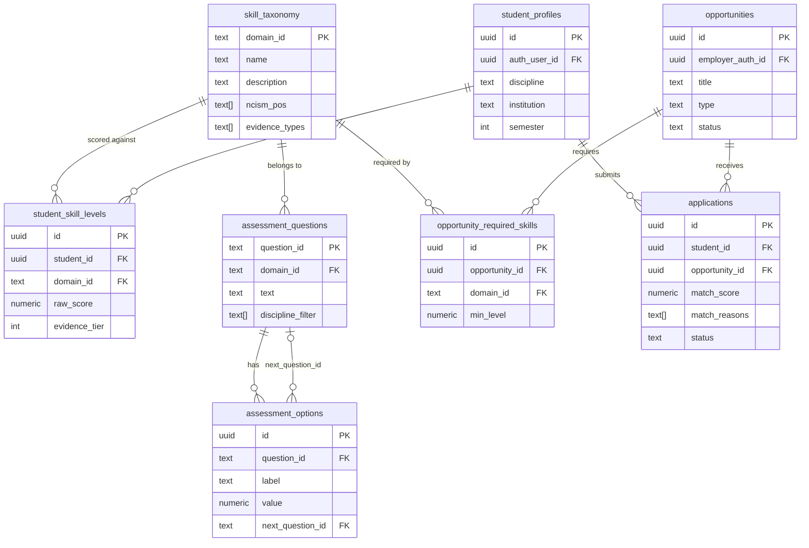

[README.md](https://github.com/user-attachments/files/32619779/README.md)
# AYUSH SkillConnect


> Evidence-backed, closed-loop skill-mapping and placement platform for AYUSH academic
> institutions. Built for **Problem Statement 26044** (Ministry of AYUSH) — Team **CodeMorph**.

*(No license has been chosen for this repo yet — add one before making it public if that matters
for your submission; see [choosealicense.com](https://choosealicense.com).)*

---

## Overview

A resume tells an employer what a student *claims*. It doesn't tell them what a faculty member
actually verified, or what an OSCE actually confirmed. AYUSH SkillConnect closes that gap with one
loop:

```
Industry Demand → Skill Taxonomy → Assessment + Evidence → Skill Gap Analysis
   → Explainable Matching → Opportunities + Tracking → Institutional Insight
   (feeds back into Industry Demand)
```

Every skill a student holds is tied to a specific NCISM-aligned taxonomy domain **and** an
evidence tier (Unassessed → Theory-verified → Observed → Institution-verified) — "skill =
competency + evidence," not a self-declared profile tag. Matching between students and
opportunities is deterministic and fully explainable (a fixed, documented formula with a stored
reasoning array per score) — never a black-box or trained-model recommendation.

Three roles: **Student** (adaptive assessment → skill profile → matched opportunities →
application tracking), **Employer** (post opportunities with required skill thresholds → review
explainably-ranked applicants), **Institution Admin** (cohort-level skill-gap analytics).

## Tech Stack

| Layer | Technology |
|---|---|
| Frontend | Next.js (App Router), React, TypeScript |
| Styling | Tailwind CSS |
| Backend logic | Next.js Route Handlers (`app/api/**`) — no separate server |
| Database | PostgreSQL via Supabase |
| Auth | Supabase Auth (email/password, 3 roles) |
| Hosting | Vercel (frontend + API) + Supabase (DB/Auth), free tier only |

## Local Setup

```bash
git clone <this-repo-url>
cd ayush-skillconnect
npm install
```

Create `.env.local` in the project root:
```
NEXT_PUBLIC_SUPABASE_URL=your-supabase-project-url
NEXT_PUBLIC_SUPABASE_ANON_KEY=your-supabase-anon-key
SUPABASE_SERVICE_ROLE_KEY=your-supabase-service-role-key   # server-side only, never commit
```

Set up the database (in your Supabase project's SQL editor, in order):
1. `schema.sql` — creates all 8 tables with Row-Level Security policies
2. `seed_taxonomy.sql` — seeds the 12-domain skill taxonomy (**unverified**, see note below)
3. `seed_assessment_stub.sql` — seeds **placeholder** assessment questions (clearly marked `[STUB]`)

Run the app:
```bash
npm run dev
```

## Database ERD



## NCISM Programme Outcome Matrix

Source: NCISM Programme Outcomes framework, as supplied for this project. **Domain-to-PO mapping
is taken directly from that source; the `evidence_types` in `seed_taxonomy.sql` are this project's
own synthesis of each domain's mapped POs and are flagged there as pending team verification** —
domains 11 and 12 especially, which have the weakest fit to their mapped POs.

| # | Domain | NCISM POs |
|---|---|---|
| 1 | Ashtavidha Pariksha & Case-Taking | PO1, PO3, PO5 |
| 2 | Dravyaguna & Rasa Panchaka | PO1, PO2, PO5, PO8 |
| 3 | Panchakarma Procedure Competence | PO4, PO5, PO6, PO8 |
| 4 | Kayachikitsa Management Planning | PO1, PO3, PO4, PO5, PO7 |
| 5 | Prakriti & Vikriti Analysis | PO1, PO3, PO5 |
| 6 | Aahar & Poshan Counseling | PO3, PO5, PO8 |
| 7 | Basic Diagnostics & Correlation | PO2, PO3, PO5 |
| 8 | Communication & Ethics | PO6, PO8, PO9 |
| 9 | Yoga & Lifestyle Prescription | PO1, PO5, PO7 |
| 10 | Research Literacy & Documentation | PO7, PO9 |
| 11 | Digital & IT Hygiene | PO7, PO8 *(weak fit — pending review)* |
| 12 | Safety & Infection Control | PO5, PO6 *(weak fit — pending review)* |

## Project Status

This is an active hackathon build, not a finished product. Current state:
- ✅ Schema, RLS policies, and the 12-domain taxonomy are defined and seeded in Supabase
- ✅ Core UI screens built (landing, assessment, skill profile, opportunity posting) —
  currently using **mock data**, not live Supabase calls, to move fast for the initial submission
- 🚧 Assessment content is **placeholder/stub** — real question bank pending
- 🚧 Auth, real Supabase-backed data flow, matching engine, application tracking, and the
  institution dashboard are the next build pass

See `Prd.md`, `Techspec.md`, `Schema.md`, `AppFlow.md`, and `Rules.md` in `/docs` for the full
product and technical specification this build follows.
